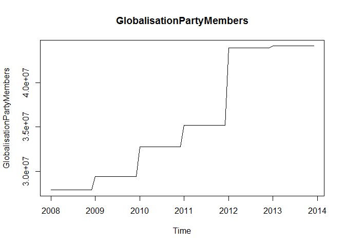

# Analysis and Forecasts
Vishal & Blake  
July 23, 2016  

### Analyzing and Forecasting Data


* *Setting current working directory to Analysis folder*  


* *Loading knitr library*  


* *Seeting chunk options and reading chunks from R scripts*  

  

```
## [1] "C:/Users/vishal/Desktop/SMU/Doing Datascience/Case Study/Unit10/Analysis"
```

```
## Loading required package: forecast
```

```
## Loading required package: zoo
```

```
## 
## Attaching package: 'zoo'
```

```
## The following objects are masked from 'package:base':
## 
##     as.Date, as.Date.numeric
```

```
## Loading required package: timeDate
```

```
## This is forecast 7.1
```

```
## Loading required package: fma
```

```
## Loading required package: tseries
```

```
## Loading required package: expsmooth
```

```
## Loading required package: lmtest
```

```
## [1] 0.9183402
```

###Summary functions for lm() and tslm() functions

*Summary of model fitted using lm() function*  

```
## 
## Call:
## lm(formula = TotalAsIs ~ TotalPlan, data = TotalAsIs)
## 
## Residuals:
##     Min      1Q  Median      3Q     Max 
## -770214 -196776   26017  182579  672705 
## 
## Coefficients:
##              Estimate Std. Error t value Pr(>|t|)    
## (Intercept) 8.959e+04  1.521e+05   0.589    0.558    
## TotalPlan   9.627e-01  4.959e-02  19.413   <2e-16 ***
## ---
## Signif. codes:  0 '***' 0.001 '**' 0.01 '*' 0.05 '.' 0.1 ' ' 1
## 
## Residual standard error: 332600 on 70 degrees of freedom
## Multiple R-squared:  0.8433,	Adjusted R-squared:  0.8411 
## F-statistic: 376.9 on 1 and 70 DF,  p-value: < 2.2e-16
```
*Summary of model fitted using tslm() function*  

```
## 
## Call:
## tslm(formula = TotalAsIs ~ TotalPlan)
## 
## Residuals:
##     Min      1Q  Median      3Q     Max 
## -770214 -196776   26017  182579  672705 
## 
## Coefficients:
##              Estimate Std. Error t value Pr(>|t|)    
## (Intercept) 8.959e+04  1.521e+05   0.589    0.558    
## TotalPlan   9.627e-01  4.959e-02  19.413   <2e-16 ***
## ---
## Signif. codes:  0 '***' 0.001 '**' 0.01 '*' 0.05 '.' 0.1 ' ' 1
## 
## Residual standard error: 332600 on 70 degrees of freedom
## Multiple R-squared:  0.8433,	Adjusted R-squared:  0.8411 
## F-statistic: 376.9 on 1 and 70 DF,  p-value: < 2.2e-16
```

###Using STL method for decomposition - summary on STL


```
##  Call:
##  stl(x = TotalAsIs, s.window = 5)
## 
##  Time.series components:
##     seasonal              trend           remainder        
##  Min.   :-1002974.3   Min.   :2074233   Min.   :-407367.5  
##  1st Qu.: -467644.6   1st Qu.:2467350   1st Qu.:-164754.1  
##  Median :  127151.7   Median :2904128   Median :  -8114.3  
##  Mean   :    2403.2   Mean   :2942792   Mean   :  -2552.6  
##  3rd Qu.:  401205.6   3rd Qu.:3393014   3rd Qu.: 141472.4  
##  Max.   : 1004335.3   Max.   :3976853   Max.   : 426737.2  
##  IQR:
##      STL.seasonal STL.trend STL.remainder data  
##      868850       925664    306227        992479
##    %  87.5         93.3      30.9         100.0 
## 
##  Weights: all == 1
## 
##  Other components: List of 5
##  $ win  : Named num [1:3] 5 27 13
##  $ deg  : Named int [1:3] 0 1 1
##  $ jump : Named num [1:3] 1 3 2
##  $ inner: int 2
##  $ outer: int 0
```

<!-- -->

*Plotting trend component that was derived by STL function*
<!-- -->


*Modification of seasonality component*
<!-- -->

### Correlation with external indicators

The indicators are as follows:

* Monthly Change in Export Price Index (CEPI)  
<!-- -->

```
## [1] 0.9183402
```

* Monthly Satisfaction Index (SI) government based data  
<!-- -->

```
## [1] 0.7033182
```

* Average monthly temperatures in Chulwalar  
<!-- -->

```
## [1] 0.8787973
```

* Monthly births in Chulwalar  
<!-- -->

```
## [1] 0.829382
```

* Monthly Satisfaction Index (SI) external index  
<!-- -->

```
## [1] 0.5400499
```

* Yearly Exports from Urbano  
<!-- -->

```
## [1] 0.8458399
```

* Yearly number of Globalisation Party members in Chulwalar  
<!-- -->

```
## [1] 0.6307932
```


* Monthly Average Export Price Index for Chulwalar  


* Monthly Producer Price Index (PPI) for Etel in Chulwalar  


* National Holidays  


* Chulwalar Index (Total value of all companies in Chulwalar)  


* Monthly Inflation rate in Chulwalar  


*	Proposed spending for National Holidays  

The indicators will be converted into individual  vectors and subsequently converted into time series. The correlation of the indicators will then be tested against the As Is exports for Chulwalar. 


