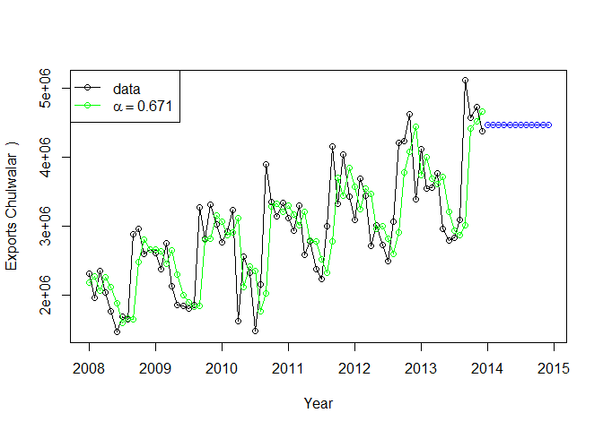
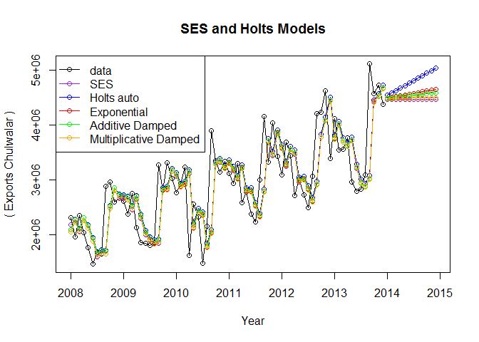
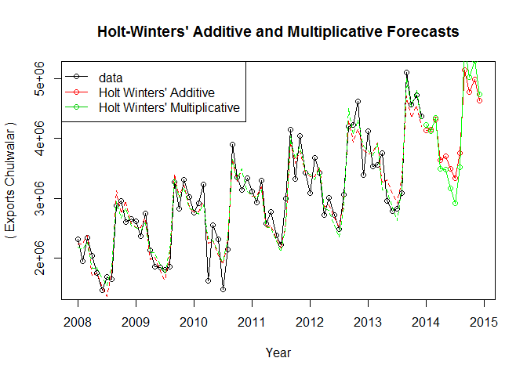

# Forecasting Models
Vishal & Blake  
July 24, 2016  


###Forecasting models  

* Ses : Simple Exponential Smoothing model  
* Holts Model  
* Holt Winter Model  

* *Setting current working directory to Analysis folder*  


* *Loading knitr library*  


* *Seeting chunk options and reading chunks from R scripts*  

  

```
## [1] "C:/Users/vishal/Desktop/SMU/Doing Datascience/Case Study/Unit10/Analysis"
```

```
## Loading required package: forecast
```

```
## Loading required package: zoo
```

```
## 
## Attaching package: 'zoo'
```

```
## The following objects are masked from 'package:base':
## 
##     as.Date, as.Date.numeric
```

```
## Loading required package: timeDate
```

```
## This is forecast 7.1
```

```
## Loading required package: fma
```

```
## Loading required package: tseries
```

```
## Loading required package: expsmooth
```

```
## Loading required package: lmtest
```

* Plot SES model

  * *Simple Exponential Smoothing* : In this type of model, forecast are calculated using averages from past values. Weight on average values reduce as values become older in timeseries.  We will plot a Simple Exponential Smoothing chart for "TotalAsIs" timeseries that contains observed data. Simple Exponential Smoothing can be used in case there is no trend and/or seasonal component in the data.  

    *In below plot we are forecasting 12 values using SES model.*  


<!-- -->


* Holt's various models (auto, exponential, damped, damped with exponential)  

    * Holt Auto    
    <!-- --><!-- -->

    * Exponential Trend  
    <!-- --><!-- -->
    
    * Dampened Trend  
    <!-- --><!-- -->
    
    * Dampened with Exponential Trend  
    <!-- --><!-- -->
    


# SES and Holts models  

<!-- -->

# Holt Winters' models  

<!-- -->


    
    
    
    
