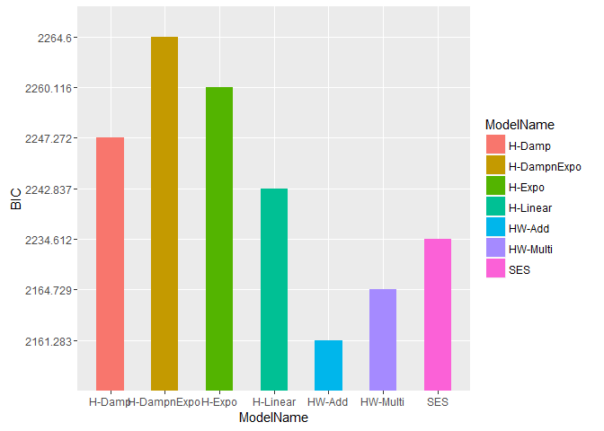

# Summary
Vishal & Blake  
July 24, 2016  

# Reading previous source files  


```
## [1] "C:/Users/vishal/Desktop/SMU/Doing Datascience/Case Study/Unit10/Paper"
```

```
## Loading required package: forecast
```

```
## Loading required package: zoo
```

```
## 
## Attaching package: 'zoo'
```

```
## The following objects are masked from 'package:base':
## 
##     as.Date, as.Date.numeric
```

```
## Loading required package: timeDate
```

```
## This is forecast 7.1
```

```
## Loading required package: fma
```

```
## Loading required package: tseries
```

```
## Loading required package: expsmooth
```

```
## Loading required package: lmtest
```

# Comparing AIC, AICc and BIC for all the models

Below 3 separate graphs show plots for AIC, AICc and BIC for all the models. After looking at them, the min AICc , min AICc and min BIC, all are from Holt Winter's additive model.
Hence, it appears that Holt Winters Additive model is the **best model** to choose for forecasting exports in 2014.


<!-- --><!-- --><!-- -->
    
    
